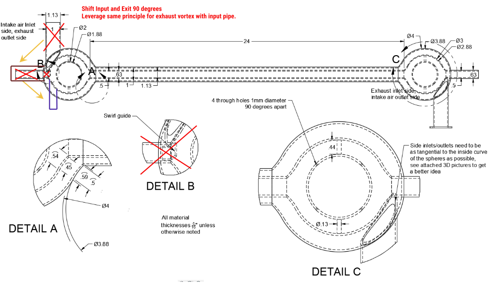

# MFMP-THOR

Research into the THOR project concept by MFMP of Inventor Malcolm Bendall's device called MSAART or ThunderStorm Generator(TSG)

- [Inventors Video Series](https://www.howtube.com/channels/StrikeFoundationEarth#tab_video_series)
- [Inventors Website](https://www.strikefoundation.earth/open-source-research)
- [MFMP Project THOR](http://www.quantumheat.org/index.php/en/home/mfmp-blog/560-thor)
- [MFMP Videos by Bob Greenyer](https://www.youtube.com/@MFMP)
- [MFMP Video Series on THOR](https://www.youtube.com/watch?v=iJ7OOU6lEWI&list=PLBgQorZu_mLnXLxYlvTv8ojoa2BRsx_o2)

# Research Notes by M.Kemp

The MFMP document by Nykyta Vovk is very detailed and includes scientific equations, these notes will be much simpler, there are some things we disagree with like the more complicated diagram being used instead of the simpler one as most devices have been demonstrated without the recirculation of exhaust gases. The Ranque-Hilsche vortex tube is an open system where as the devices demonstrated are closed heatexchangers, we understand this was given at the tesla tech backstage demo to illustrate the counter vortex flows only. We think these points may have caused some confusion in the community. The document also refers to the device as Vortex Generator Retrofit(VGR), We will use the inventors initials with appended D* all caps, eg MBD* to refer to each device going forwards in this write up of our notes. 

The MBD* system is very similar to the GEET system by Paul Pantone (PPD*), to which we were motivated to investigate earlier this year due to the potential exotic plasma effects, however our efforts failed to replicate the PPD* system. We elected to use the carburettor and omit the bubbler (we believe this is where our failure stems from). In addition to the bubbler the MBD* employs a UV light and geometric differences in the heat exchanger. 

## UV - Ioniser 

The importance of this part of the MBD* system was a curiosity and 100um was mentioned as a key frequency. So to start we begin by looking at what UV light can do!

Ok so looking at the diagrams 100nm is in that range, so the um could be a mistake! We also need to consider what Bob Greenyer says about Oxygen and it's magnetic interactions and magnetic moment, along with electron spin, CNO Cycle and ionisation (Makes REF to Moray B King and Paul Koloc). So in order to create the best type of oxygen being O2 we can use a bulb at ideally 254nm wavelength but up to 300nm is fine.

- ParaMagnetic atoms are true when the electron count is odd or 10 or 16, they will align/attract.
- DiaMagnetic atoms are true when the electron count is even except for 10 and 16, they will repel.
- O, Magnetic Moment x0-1.67, is paramagnetic
- O2, Magnetic Moment x17860, is paramagnetic
- O3, Magnetic Moment x680, is paramagnetic

So by giving our air the strongest level of ionisation we are setting the gas up to form highly charged particles for the next phase of the system. By studying nano bubbles we were able to find a reference stating that this ionisation would also prevent the premature collapse of the nano bubbles, hold on to this thought. What Bob did highlight is that the copper oxide and UV would have a photoelectric and photocatalytic effect of splitting water into Browns gas if the air intake was moist enough but not too much so as to prevent charge clusters building up potential, perhaps even some moisture may work its way backwards from the bubbler.

- [REF A](https://steril-aire.com/does-uv-light-generate-ozone/)
- [REF B](https://www.oxidationtech.com/ozone/ozone-production/uv-lamp.html)
- [REF C](http://solar-center.stanford.edu/about/uvlight.html)

## Bubbler

Why is this component important, it has water stainless steel and bubbles? The main clue was a concern over the bubble size, So this lead to researching nano bubbles and cavitation or the latter lead to the former. 

### Nano bubbles

- Nano bubbles are invisible but diffract a lasers light.
- Regular bubbles rise fast.
- Micro bubbles rise in seconds/mins.
- Nano bubbles can persist for many days.
- When Nano bubble solutions are shocked, they join into micro bubbles and fizz out.
- Nano bubbles affect surface tension.

  

So on this chart you can see the ideal size for a nano bubble is 100nm, Now if you recall that thought, the key frequency if at 100um would be too big for nano bubbles, Now if you look at the different ways to create nano bubbles!

#### Pressure Wave

- [article ref](https://www.nature.com/articles/s41598-018-38066-5)

You will find that pressures changes  can create nano bubbles and the engine is creating vacuum pressure drop each cycle. By this process you can go from 100um to ~100nm, repeatedly shrinking and expanding the bubbles down into nano bubbles until they collapse with cavitation effects adding heat and more excited electrons by the water hammer shock.  [See this video series on water hammer effects especially episode 5](https://www.youtube.com/watch?v=1E26PgIq9JM&list=PLCMwms24CHliNA9VLYjAYKugmygB67BeB)

We should certainly have water vapour by this point and water molecules can act as charge carriers, we need carbon which could come from the steel as the bubbles collapse. 

#### Bubble Lifecycle

Photon emmission pre bubble deformation as depicted by the redish bubbles.

Also under normal non-ionised condition the gas bubble is surrounded by negative charges, when ionised this charge is inverted to positive charges.

long lived nano bubbles require ionised gasses to bind at the gas/liquid interface.

[reference paper](https://www.scribd.com/document/325010384/Nano-Buble-Nozzle) 

Excerpt, answers the UV question as to why it's needed. 'Stabilization as long lived nano bubbles occurs when ions bind to the gas/liquid interface, yet display full collapse and complete dissolution after several minutes in the absence of bound ions.'

#### Other ways to create nano bubbles

##### ultrasonics 

We found a number of videos showing ultrasonic devices usually for emulsifiers, but did not explore this much further.

##### Porosity

[Satoshi Anzai](https://www.youtube.com/watch?v=OR57AGY3shM) states that is impossible to create nano bubbles with non carbon based ceramics. We found that some [researchers found that hardwood biocharcoal](https://www.scribd.com/document/325010384/Nano-Buble-Nozzle) offers the same porosity much cheaper than the ceramic airstones of Satoshi. This method does not seem applicable as a flow of water is required to bump the bubbles off the stone, It could be a good substitute for the airstone buts need testing, also micro carbon particulates will cloud water.

##### Geometry

We found a few different geometry based devices to create nano bubbles, these all need a flow of water and perhaps certain flow rates. 
We like these since they mostly tie into sacred geometry, so we used the windhexe as an example to refer and found the oxydoser.com to be of similar design. Our favourite is from https://globalcavitation.com 

Other designs were of venturi tubes with and without air lines, they leverage acoustic hydrodynamic pressure changes. Also to note were hydrosonic pumps.
Vortex cavitation is more agressive than spherical cavitation. Vortex cavitation causes luminescence! sound speed important.

TODO: Add drawings for hydrosonic pump, oxydoser and venturi type tubes, turbine like stator structure and global cavitation device comparisons...

## Heat Exchanger/Reactor

What value does this component add to the system? The heat will add higher vibrational energy, so the incoming atoms will collect this radiation and move faster, more speed, more collisions? like a particle accelarator as claimed. Heat will realign magnetic domains in metals (as witnesed with PPD* rods), will this field play a role in aiming particles? Some elements may change phases which may bring endothermic or exothermic chemical reactions.

There is the claim of cooling in the centre of the reactor, could this be the endothermic chemical reaction, ?hydrogen steam reforming, partial oxidisation with a nickel catalyst 316L grade steel? (Need to better understand what Bob said).

The vortex claim, makes one think of modifications done to race cars so we investigate that and also consider water/steam injection in aviation and car history aka water doping. Bob Greenyer also introduces a new angle of Partial Oxidation in steam reforming with a nickel catalyst as well as the possibility of more exotic lenr reactions.

### Exhaust vortex in racing

Used to eliminate backpressures allowing the engine to breath it's next intake easily. vortexexhaust.com claims +10% BHP +10% Torque +3-8 MPG -33% Emissions. [US Patent 10,605,139](https://patents.google.com/patent/US10605139B2/en?oq=10605139)

### Water/Steam Injection

During WW2 spitfires had an emergency water injection mode. This gave the engine a power boost but was detrimental to the engine lifecycle, often ruining the engine. Methanol was mixed with the water m30/70w This has a super cooling effect by about 25c which will condense the air/fuel mixture giving a greater power upto +40%. The water will absorb heat and transfer it out of the engine improving emissions and steam cleaning away the carbon buildup. Turbo systems give better results. BMW 1 series M4 claimed +10 BHP +10% Torque +20%/+2-6 MPG.

Actual Steam injection is used to reduce NOx emmissions and boost power, chilling effect is vastly reduced and demineralised water is required.

Our view is that any water vapour will flash into steam, so any chilling or condesing of mixture is unlikely to play a role and methanol is not added either.

### Electrostatics role

water vapour/steam traverses most of the components. Water molecules will act as charge carriers and if charge seperation occurs will lead to positive/negative biases in parts of the system, think of lord Kelvins water droplet device.

Bob Greenyer once again raises the role of the 'armstrong effect' 1840 which is a quite fascinating steam boiler electrostatic generator which was the most powerful device until it was replaced by the wimhurst machine.

## Summary 

There could be 3 modes, a basic mode, a chemical mode and an exotic mode. We don't understand the latter two enough, so assume we are wrong. 

In basic mode; the UV and copper oxide will create some browns gas, the bubbler will aerosolise some water molecules, the heat exchanger will create steam and it's vortex aspects will help move the exhaust and intake charges. you may see +20% BHP +20% Torque +5-14 MPG -33% Emmissions, This is great!

Our initial understanding was the bubbles played a key role and that the UV was to support their lifecycle to ensure they lived long enough to shrink and collapse more often. During bubble collapse a plasma state is reached, We understand that if there is enough potential energy that atoms can transmutate into heavier or lighter elements.  We need to better understand the chemistry and physics and what takes places from the heat exchanger onwards, our understanding is still developing.

# Goals

1. Run engine in MBD* configuration with laymans tooling.
2. Show reduction in carbon monoxide.
3. Increase runtime per x ml of fuel.
4. Prove an effect beyond combustion.
